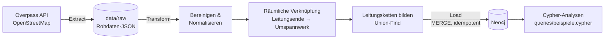
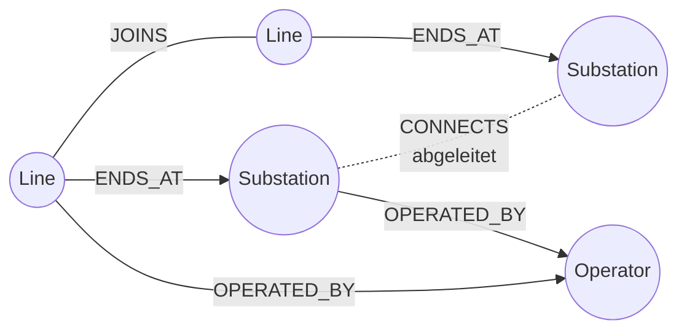

# netzasset-graph


Das Höchstspannungsnetz (220/380 kV) in Nordrhein-Westfalen als **Graph in Neo4j**, aufgebaut aus offenen OpenStreetMap-Daten über eine reproduzierbare **ETL-Pipeline**.

Das Projekt zeigt, wie sich verstreute, uneinheitlich gepflegte Netzasset-Daten zu einem verknüpften Datenmodell zusammenführen lassen. Ein solches Modell ist die Grundlage für Netzasset-Plattformen und Digitale Zwillinge.

```
docker compose up --build
```

Danach steht das Netz im Neo4j Browser unter http://localhost:7474 bereit (Login `neo4j` / `netzasset-demo`).

---

## Fragestellung

In OpenStreetMap sind Leitungen und Umspannwerke **nicht miteinander verknüpft**. Eine Leitung ist nur eine Linie, die zufällig in der Nähe einer Umspannwerksfläche endet. Dazu kommen:

- Leitungen sind in viele Abschnitte zerlegt, die sich Masten als Endpunkte teilen
- auf denselben Masten verlaufen oft Systeme unterschiedlicher Spannung
- Betreiber sind uneinheitlich geschrieben (`Amprion`, `Amprion GmbH`, `amprion`)
- Spannungen und Stromkreise stehen als Freitext in Tags (`380000;220000`, `1;2`)

Die Pipeline löst diese Punkte und leitet daraus ab, **welches Umspannwerk mit welchem verbunden ist**.

## Architektur



| Schritt | Modul | Was passiert |
|---|---|---|
| Extract | `pipeline/extract.py` | Overpass-Abfrage für Region und Spannungsebenen; Rohdaten werden zwischengespeichert, Wiederholung bei Überlastung |
| Transform | `pipeline/transform.py` | Spannungen und Stromkreise parsen, Betreibernamen zusammenführen, Leitungslängen berechnen (Haversine), Leitungsenden per Punkt-in-Fläche und Abstandstoleranz Umspannwerken zuordnen, Abschnitte gleicher Spannung zu Ketten verbinden, Verbindungen zwischen Umspannwerken ableiten |
| Load | `pipeline/load.py` | Constraints und Punktindex anlegen, Daten in Batches per `MERGE` schreiben; ein erneuter Lauf aktualisiert statt zu duplizieren und entfernt in OSM gelöschte Objekte |

## Datenmodell



| Knoten | Wichtige Eigenschaften |
|---|---|
| `Substation` | `osm_id`, `name`, `voltages_kv`, `max_voltage_kv`, `location` (Point) |
| `Line` | `osm_id`, `name`, `ref`, `voltages_kv`, `circuits`, `length_km`, `start_location`, `end_location`, `unmatched_ends` |
| `Operator` | `name` (normalisiert) |

| Beziehung | Bedeutung |
|---|---|
| `(:Line)-[:ENDS_AT {end, distance_m}]->(:Substation)` | Leitungsende liegt in der Umspannwerksfläche (`distance_m = 0`) oder innerhalb der Toleranz |
| `(:Line)-[:JOINS {osm_node}]-(:Line)` | zwei Abschnitte mit gemeinsamer Spannung teilen sich einen Mast |
| `(:Substation)-[:CONNECTS {line_ids, voltages_kv, chain_length_km, branching}]-(:Substation)` | abgeleitet: beide Umspannwerke liegen an derselben Leitungskette |
| `(:Substation\|Line)-[:OPERATED_BY]->(:Operator)` | Betreiber |

**Warum ein Graph?** Fragen wie „Welche Umspannwerke hängen über maximal drei Verbindungen an Umspannwerk X?“ oder „Welcher Weg verbindet A und B?“ sind in einem relationalen Modell rekursive Joins. In Cypher sind sie eine Zeile.

## Starten

Voraussetzung: Docker mit Docker Compose.

```bash
cp .env.example .env          # optional: Region, Spannungen, Passwort anpassen
docker compose up --build     # startet Neo4j und führt die Pipeline einmal aus
```

Der Pipeline-Container beendet sich nach dem Lauf, Neo4j läuft weiter. Beenden mit `docker compose down` (Daten bleiben im Volume erhalten; `docker compose down -v` löscht sie).

Der erste Lauf ruft die Daten von der öffentlichen Overpass-API ab (je nach Auslastung 1–3 Minuten). Folgeläufe verwenden die gespeicherten Rohdaten. Neu abrufen:

```bash
docker compose run --rm pipeline python -m pipeline.run --refresh
```

Andere Region, z. B. Niedersachsen: `REGION=DE-NI` in `.env`.

### Ohne Docker

```bash
python -m venv .venv && source .venv/bin/activate
pip install -r requirements.txt
python -m pipeline.run --skip-load      # nur Extract + Transform, Kennzahlen in data/run_stats.json
```

### Tests

```bash
python -m unittest discover -s tests -t . -v
```

Die Tests laufen ohne Netzwerk und ohne Neo4j gegen ein kleines Beispielnetz (`tests/fixtures/mini_grid.json`). Sie prüfen unter anderem, dass Leitungen nur mit Abschnitten gleicher Spannung verbunden werden und dass die Abstandstoleranz eingehalten wird.

## Beispielabfragen

In `queries/beispiele.cypher`, unter anderem:

- Netzbild aller Umspannwerke und Verbindungen
- am stärksten vernetzte Umspannwerke
- kürzester Weg zwischen zwei Umspannwerken
- Leitungskilometer je Betreiber und Spannungsebene
- Umspannwerke im Umkreis eines Punktes (räumlicher Index)
- Integrationslücken: Leitungsenden ohne Zuordnung

## Grenzen

- OSM ist eine Community-Datenquelle: Vollständigkeit und Aktualität sind nicht garantiert, Netztopologie und Schaltzustände fehlen.
- Abzweige, bei denen eine Leitung in der Mitte einer anderen beginnt, werden nicht erkannt (nur Endpunkt-zu-Endpunkt).
- `CONNECTS` ist eine Ableitung aus der Geometrie, keine elektrische Verbindungsaussage. Bei Ketten mit mehr als zwei Umspannwerken (`branching = true`) ist `chain_length_km` die Gesamtlänge der Kette.
- Die Abstandstoleranz (Standard 250 m) ist ein Kompromiss zwischen Fehlzuordnungen und Lücken. Abfrage 8 zeigt die Lücken.

## Ausbaustufen
- [ ] Anreicherung der Stammdaten
- [ ] Verlinkung zu OpenStreetMap 
- [ ] Automatisierte Datenqualitätsprüfungen mit Report (Vollständigkeit, Konsistenz, verwaiste Objekte)
- [ ] Netztopologie-Analysen
- [ ] Natürlichsprachige Abfragen über einen KI-Agenten (Text → Cypher)

## Daten und Lizenz

Kartendaten © [OpenStreetMap](https://www.openstreetmap.org/copyright)-Mitwirkende, verfügbar unter der [Open Database License (ODbL)](https://opendatacommons.org/licenses/odbl/). Abgeleitete Datenbestände unterliegen ebenfalls der ODbL.

Code: MIT-Lizenz.
